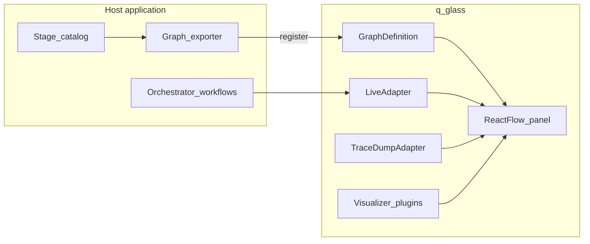

# 01 — Architecture

q_glass separates **declaration**, **display**, and **execution**.

## Layers

| Layer | Responsibility | Today |
|-------|----------------|-------|
| **GraphDefinition** | Static topology + stage ids | JSON fixture + TypeScript types |
| **UI** | Canvas, toolbar, inspector | React + Vite + React Flow |
| **RuntimeAdapter** | Load graph, run state, stop/step | `SimulatedAdapter` / `NoopAdapter` |
| **Visualizers** | Render I/O beyond JSON | JSON + Python `ViewSpec` tabs |

## Source of truth

The **declared graph** is what humans see. Hosts should keep their executor
topology in lockstep with that graph (CI on the host). History-derived UIs
remain useful ops tools but do not replace the declared flowchart.

## Control plane vs data plane

- **Data plane**: orchestrator workers run activities headlessly.
- **Control plane**: q_glass (optional) sets breakpoints, steps, inspects
  artifacts / dumps.

See [03-runtime-adapters.md](./03-runtime-adapters.md) and
[02-graph-schema.md](./02-graph-schema.md).
